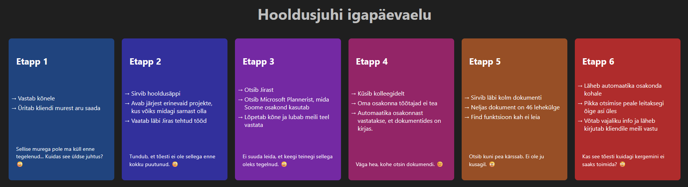

# Kasutajateekond

## Probleem

Erinevate osakondade töölised ei suuda leida üles vajalikke andmeid, kuna firma on suur ja erinevaid äppe ning tarkvarasid on palju. Erinevad andmed ei ole samuti igaühe jaoks loogiliselt jaotatud.

## Lahendus

Luua ühtne Viki, millel oleks piisavalt võimas ja kiire otsingumootor, et kõik vajalik igaühe jaoks koheselt kättesaadav oleks. Lisaks peaks olema sealne info võimalikult visuaalselt ning lihtsalt edastatud ning seega kõigile arusaadav.

### Hooldusjuhi näide

Kliendilt, kellega on loodud hooldusleping, tuleb kõne. Protsess näitab, kuidas antud probleemi lahendamine toimib.

<br>

# Kirjeldus

Kuna kõige enam soovitatud _open source_ Viki, [wiki.js](https://js.wiki/), toimib raamistikue "Vue.js" alusel, siis tegin õppimise mõttes antud projekti samas raamistikus. Võimalik käivitada all oleva automaatselt inglise keeles genereeritud ja täiustatud õpetuse alusel või näha tulemust pildilt: [](src/assets/kasutajateekond.png)

<br>

# Project setup

## Prequisites

### Node.js

The JavaScript runtime environment. This is essential for running the Vue CLI and the development server. You can download it from the official Node.js website. It is recommended to download the LTS (Long Term Support) version.

### npm

npm (Node Package Manager) or Yarn: These are package managers that come with Node.js. They are used to install the project's dependencies. npm is included with Node.js, so if you have Node.js, you have npm. If you prefer to use Yarn, you can install it separately.

You can check if you have these installed by running the following commands in your terminal:

```
node -v
npm -v
# or
yarn -v
```

## How to run

```
npm install
```

### Compiles and hot-reloads for development

```
npm run serve
```

### Compiles and minifies for production

```
npm run build
```

### Lints and fixes files

```
npm run lint
```
